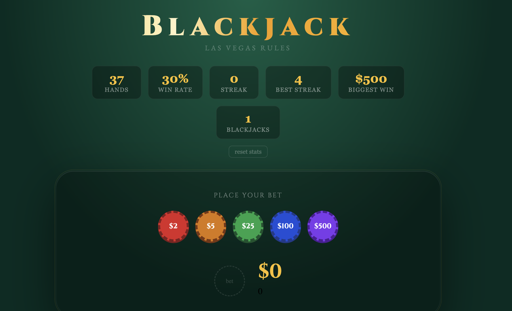
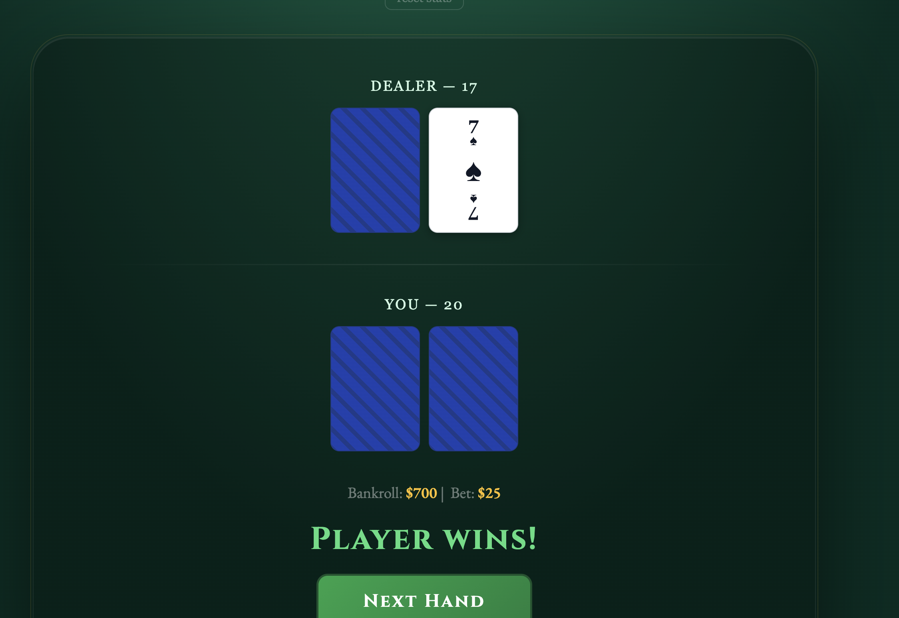

# blackjack-remade

A browser-based Blackjack game built with React + Vite.

This is actually a remake of the first real project I ever built which is a terminal Blackjack game I wrote in grade 10 when I was around 14. That version had ASCII card art, a hand-rolled Fisher-Yates shuffle, and way too many nested if statements. I lost the original code at some point, so I rebuilt it from scratch with everything I know now.



---

## what's in it

- Full Blackjack rules: hit, stand, double down, split pairs
- 6-deck shoe that reshuffles automatically
- Basic Strategy AI: an optional hint system that tells you the mathematically optimal move for any hand. Same system card counters use as their baseline
- Insurance when the dealer shows an Ace
- Animated chip stack betting UI
- Card deal animations + dealer card flip
- Confetti on wins
- Web Audio API sound effects: no libraries, just raw oscillators
- Stats tracker persisted to localStorage — win rate, streak, biggest win, blackjack count
- Keyboard shortcuts: `H` hit, `S` stand, `D` double, `P` split
- Rebuy button to instantly re-place your last bet

---

## stack

- React 19
- Vite 8
- Zero UI libraries: all styles are inline or vanilla CSS
- Zero game libraries: all game logic written from scratch

---

## run it locally

```bash
git clone https://github.com/sabrinahaniff/blackjack-remade.git
cd blackjack-remade
npm install
npm run dev
```

Opens at `http://localhost:5173`

---

## what's next

- Mobile responsive layout
- Win/loss history streak bar
- Game over screen when bankroll hits $0
- More gameplay: surrender, side bets

---

## background

The original version was a grade 10 CS project. It ran in the terminal, used ASCII art for cards, and had a basic dealer AI that just hit until 17. I'm rebuilding it properly as a way to see how far things have come since then.